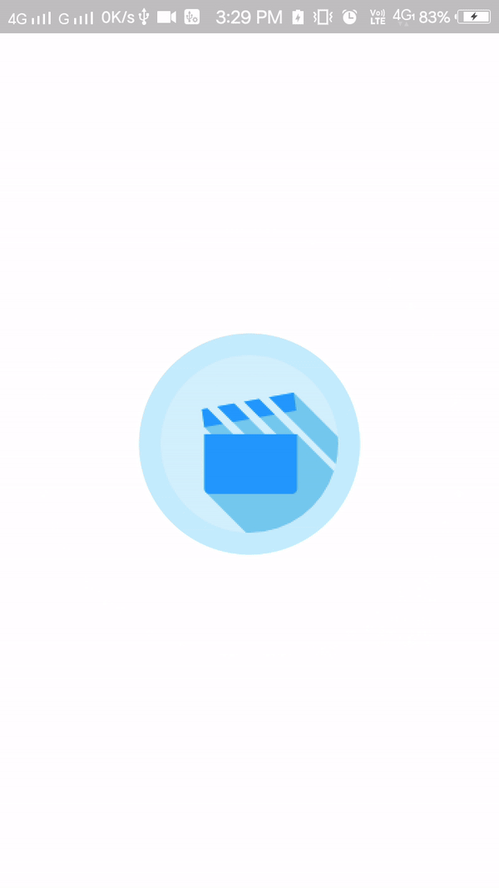

# Splash Screen Animation

Sample Animation using the Animated Widget.
This example shows how to use multiple tweens on the same animation controller, where each tween manages a different effect in the animation.

# Preview

|   |
 
## Questions?🤔

Hit me on twitter 

## Getting Started with Flutter

For help getting started with Flutter, view online
[documentation](https://flutter.io/).

## License
Copyright 2018 Bhavik Makwana

Licensed under the Apache License, Version 2.0 (the "License"); you may not use this file except in compliance with the License. You may obtain a copy of the License at

http://www.apache.org/licenses/LICENSE-2.0

Unless required by applicable law or agreed to in writing, software distributed under the License is distributed on an "AS IS" BASIS, WITHOUT WARRANTIES OR CONDITIONS OF ANY KIND, either express or implied. See the License for the specific language governing permissions and limitations under the License.
